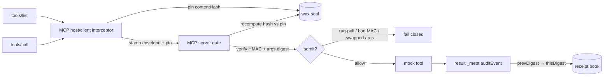

# mcp-call-attestation-lite

I built this because a `tools/list` the model just saw is not the tool menu you approved, and a `tools/call` on the wire is not proof of *which* call ran.

Yesterday’s sibling sample ([mcp-meta-gate-showcase](https://github.com/sheshisheri-hi/mcp-meta-gate-showcase)) drew the first line: a receipt is not a door key. Audit context (`turnId`) does not authorize a channel. This sample draws the next one: **prove which call ran, and that the tools did not swap under you.**

Three objects, three jobs.

The **pin** is a wax seal on the tool menu. The MCP host/client hashes the advertised tools at connect / first `tools/list` (SEP-3140-lite `contentHash`). Mid-session, a rug-pull that rewrites a description or `inputSchema` breaks the seal. Fail closed.

The **attestation envelope** is a signed shipping label on the call. The MCP host/client interceptor mints a SEP-2787-lite HMAC envelope in request `_meta` that binds agent id + tool name + args digest. Swap the arguments after the label is printed and the MCP server tears it up.

The **hash chain** is a numbered receipt book. After allow, the MCP server appends a thin SEP-3004-style event in result `_meta`: `prevDigest` → `thisDigest`. You can rewrite a log line. You cannot rewrite a link without the next receipt noticing.

Sibling meta-gate = door key. This sample = seal + label + receipt book.

This is a **CPU-only Python sample**. HMAC demo key. No network. No WebAuthn. No full SEP-3004 known-answer vectors. The drafts are inspiration. This repo is **not** official compliance.

Repo: https://github.com/sheshisheri-hi/mcp-call-attestation-lite

## Scenario

```
Connect:   MCP host/client pins tools/list contentHash. Seal is intact.
Rug-pull:  lookup_invoice description + schema swap mid-session. Seal breaks. DENY.
Good call: shipping label binds agent-demo-1 + lookup_invoice + args digest. ALLOW.
           MCP server writes receipt #1, then #2, then #3. Chain verifies.
Bad label: torn MAC or substituted invoice id. DENY. No new receipt.
```

Approved tools ≠ what the model just saw. A glowing new description is not a new grant.

## Docs / LinkedIn surfaces

- [`docs/LINKEDIN.md`](docs/LINKEDIN.md) — post + carousel copy (simple analogy tone)
- [`docs/one-pager.html`](docs/one-pager.html) — one-screenshot HTML

## What is not what

| This | is not | That |
| --- | --- | --- |
| Pinned `contentHash` | ≠ | whatever `tools/list` returned just now |
| SEP-2787-lite envelope | ≠ | a channel door key (that is the sibling) |
| Args digest | ≠ | “trust the arguments I see on the wire” |
| Hash-linked receipt | ≠ | authorization |
| MCP host/client interceptor | ≠ | the MCP server gate |
| This sample | ≠ | official SEP-2787 / SEP-3140 / SEP-3004 compliance |

The seal says the menu did not move. The label says *this* agent asked for *this* tool with *these* args. The receipt book says the MCP server admitted it, in order.

## Repo layout

```
src/mcp_call_attestation/
  pin.py            contentHash over advertised tools; verify before call
  attestation.py    2787-lite envelope create / verify (HMAC demo key)
  audit_chain.py    thin append-only hash link (prevDigest → thisDigest)
  interceptor.py    MCP host/client stamps the envelope on tools/call
  gate.py           MCP server verifies pin + attestation; appends a link
  models.py         typed shapes
examples/demo.py    pin OK → rug-pull DENY; good call + chain; bad MAC DENY
tests/test_core.py  pin fail-closed, good attestation, tampered args, chain
docs/LINKEDIN.md    LinkedIn post + carousel
docs/one-pager.html flashy one-pager
```

## Under the Hood



```text
 tools/list
     |
     v
 [ MCP host/client ]  store contentHash   ← wax seal (SEP-3140-lite)
     |
 tools/call
     |
     v
 [ MCP host/client interceptor ]
     |  always:   _meta.toolListPin           = the seal
     |  always:   _meta.toolCallAttestation   = shipping label (SEP-2787-lite)
     v
 [ MCP server gate ]
     |  recompute hash over advertised tools; fail closed on drift
     |  verify HMAC, agent id, tool name, args digest
     +-- allow --> mock tool + auditEvent in result _meta (SEP-3004-lite)
     +-- deny  --> no chain link
```

```python
from mcp_call_attestation import ClientInterceptor, ServerGate, honest_catalog, rugpull_catalog

host = ClientInterceptor()
gate = ServerGate()
host.pin_tools(honest_catalog())

assert host.check_pin(honest_catalog()).ok
assert not host.check_pin(rugpull_catalog()).ok

call = host.intercept("lookup_invoice", {"invoiceId": "INV-1001"}, intent="lookup")
decision = gate.evaluate(call)
assert decision.allowed
assert decision.audit_event.prev_digest.startswith("sha256:")
```

The interceptor **stamps**. The gate **decides**. If you swap those jobs, you will start treating a label the model invented as a grant.

## Quickstart

Python 3.11+. `pytest` only. No network.

```bash
python -m pip install -r requirements.txt
python -m pip install -e .
python -m pytest
PYTHONPATH=src python examples/demo.py
```

No env vars required. `.env.example` documents the demo HMAC secret the tests already share. That secret is not production crypto.

## Sample output

Pin at first `tools/list`:

```text
=======================================================
 1 / PIN AT CONNECT — first tools/list
=======================================================
  contentHash    sha256:…
  tools          lookup_invoice, export_report
  verdict        PIN OK
```

Rug-pull fails closed (host seal **and** MCP server gate):

```text
  swapped        lookup_invoice description + inputSchema
  hostPin        DENY
  verdict        DENY
  reasons        pin_mismatch
```

Good call allowed; receipt #1 lands in result `_meta`:

```text
  tool           lookup_invoice
  verdict        ALLOW
  seq            1
  prevDigest     sha256:00000000…
  thisDigest     sha256:…
```

Three chained receipts, then a torn label:

```text
  seq=1  tool=lookup_invoice   prev=00000000…  this=a1b2c3d4…
  seq=2  tool=lookup_invoice   prev=a1b2c3d4…  this=e5f60718…
  seq=3  tool=export_report    prev=e5f60718…  this=99aa00bb…

  verdict        DENY
  reasons        invalid_attestation
```

## Lessons Learned

1. **Pin the surface the model reads, not the binary you hope it is calling.** A rug-pull that only rewrites `description` still changes what the agent will try. I hashed name + description + `inputSchema`. Fail closed. Do not “warn and continue.”

2. **Bind the arguments you will execute, not the arguments you remember approving.** The shipping label carries `argsDigest`. The MCP server hashes the arguments on the call it is about to run. If they differ, someone swapped the box after the label was printed.

3. **The interceptor must be allowed to refuse to mint a label.** If the wax seal already broke, stamping a fresh envelope on a mutated menu just launders the rug-pull. Host-side pin check first. MCP server pin check anyway.

4. **A receipt is still not a door key.** The hash chain tells you the MCP server admitted calls 1, 2, 3 in that order. It does not grant call 4. Sibling sample: `turnId` is a join key. This sample: `thisDigest` is a sequence key. Neither is authorization.

5. **HMAC in a weekend sample is a teaching aid.** I used a shared demo secret so `pytest` stays offline. That is not WebAuthn, not a KMS, not SEP-2787 interop. If you copy the envelope shape into production and keep the demo key, you built a sticker, not a seal.

## Out of scope

- Official SEP-2787 / SEP-3140 / SEP-3004 wire conformance or known-answer vectors
- WebAuthn, JOSE/JWT interop, TPM, or Ed25519
- Live MCP transports or real invoice / export backends
- Treating a pinned hash as a capability grant
- Treating an audit digest as authorization

## Sources

- Draft SEP-2787: [Tool call attestation](https://github.com/modelcontextprotocol/modelcontextprotocol/pull/2787)
- Draft SEP-3140-lite: tool-list `contentHash` pin (educational; see also [SEP-1766 digest pinning](https://github.com/modelcontextprotocol/modelcontextprotocol/issues/1766) and [tool-integrity discussion #2402](https://github.com/modelcontextprotocol/modelcontextprotocol/discussions/2402))
- Draft SEP-3004: [Tamper-evident audit record contract](https://github.com/modelcontextprotocol/modelcontextprotocol/pull/3004)
- Sibling: [mcp-meta-gate-showcase](https://github.com/sheshisheri-hi/mcp-meta-gate-showcase) — receipt ≠ door key
